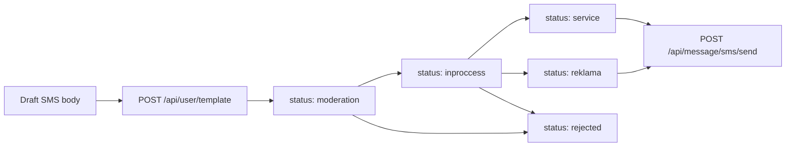

# Eskiz SMS templates

How message templates work in the [Eskiz.uz](https://eskiz.uz) SMS gateway, how moderation status is reported, and how to manage them via API or the [`eskiz-test/`](../eskiz-test/) helpers.

Official Postman collection: [SMS Gateway by Eskiz.uz](https://documenter.getpostman.com/view/663428/TVK5eMco?version=latest) (Templates section).

**Base URL:** `https://notify.eskiz.uz`

---

## Why templates exist

Uzbek mobile operators require Eskiz to pre-screen SMS bodies before delivery on activated (paid) accounts. Eskiz stores each submitted body as a **template**, runs human moderation, then allows sends only when the outgoing `message` matches an **approved** template.

Practical consequences:

1. You cannot freely invent SMS text after the account is activated and topped up.
2. The text you send through `/api/message/sms/send` must match an approved template **character-for-character** (digits used as OTP/placeholders are the usual exception — see [Matching rules](#matching-rules)).
3. Submitting a template does **not** send an SMS. It only queues text for moderation.

Templates are per Eskiz account (the email/API password you use for login).

---

## Account stages

### Test / pre-activation

On a fresh or still-test account, Eskiz documents three built-in phrases you may send without your own templates:

```text
Это тест от Eskiz
Bu Eskiz dan test
This is test from Eskiz
```

Use these only for smoke-testing credentials and delivery.

### Activated / production

After the account is activated and has balance:

- The three test phrases **stop working**.
- Only text that matches a moderated, approved template is accepted.
- A typical rejection message is along the lines of: the SMS text has not passed moderation yet (`Этот смс текст еще не прошёл модерацию`).

Always submit and wait for approval **before** wiring production message bodies into the bot (`ESKIZ_MESSAGE_TEMPLATE` / payment SMS text).

---

## Lifecycle



| Step | What happens |
|------|----------------|
| 1. Draft | Finalize exact Latin/Cyrillic wording, brand/resource name, purpose |
| 2. Submit | `POST /api/user/template` with form field `template`, or cabinet **СМС → Мои тексты** |
| 3. Wait | Moderation often runs on weekdays (~10:00–16:00 local); expect hours to ~1 day |
| 4. Check | `GET /api/user/templates` until status is `service` / `reklama` (or `rejected`) |
| 5. Send | Use the approved text as the `message` field on send |

---

## Template statuses

Returned on each item from `GET /api/user/templates` as `status` (spelling is from Eskiz’s API):

| Status | Meaning |
|--------|---------|
| `moderation` | Submitted; waiting in the moderation queue |
| `inproccess` | Being processed (API spelling; not `inprocess`) |
| `service` | Approved as a **service** (transactional) template — OTP, payment links, notifications |
| `reklama` | Approved as an **advertising** template |
| `rejected` | Denied — revise text and submit a new template |

`service` vs `reklama` affects how Eskiz/operators classify the traffic. Payment-link and OTP messages should target **service** wording (clear brand + purpose, no promo fluff).

Each list item typically includes:

| Field | Description |
|-------|-------------|
| `id` | Template id |
| `original_text` | Text you submitted |
| `template` | Normalized / stored template string (may be empty while pending) |
| `status` | One of the statuses above |

Example list payload shape:

```json
{
  "success": true,
  "result": [
    {
      "id": 1,
      "template": "",
      "original_text": "rofeev.uz: Oplata uslug. Ssylka: https://example.com/pay/1",
      "status": "moderation"
    }
  ]
}
```

---

## Matching rules (send vs approved text)

When you call `POST /api/message/sms/send`:

1. Body must be **multipart/form-data** (`mobile_phone`, `message`, `from`) — not JSON.
2. `message` must align with an approved template for your account.
3. Keep punctuation, spaces, line breaks, and quotes identical. Curly quotes (`‘’“”`) vs ASCII (`'"`) can break matching and also change GSM encoding / billing.
4. For OTP-style templates, submit a concrete sample code (e.g. `1234`) in the template. On send, changing **only** those digits is the usual pattern; do not invent `{code}` placeholders in the Eskiz cabinet — Eskiz does not use that syntax.
5. Prefer Latin transliteration for bilingual RU+UZ if you need a single SMS part (Cyrillic drops the per-part limit to ~70 characters).

Operator expectations for code/OTP SMS (even if Eskiz approves bare text):

- A **resource / brand** name (site or product)
- A clear **purpose** (registration, login, payment, etc.)

Bare `"Your code: 1234"` is often rejected by operators.

---

## API reference

All template endpoints require:

```http
Authorization: Bearer {token}
```

Obtain the token with `POST /api/auth/login` (multipart `email` + `password`). Token lifetime is commonly cited as ~30 days; refresh with `PATCH /api/auth/refresh`.

### List templates

```http
GET /api/user/templates
```

```bash
curl --location 'https://notify.eskiz.uz/api/user/templates' \
  --header 'Authorization: Bearer {your_token_here}'
```

### Submit a template for moderation

```http
POST /api/user/template
Content-Type: multipart/form-data
```

| Field | Required | Description |
|-------|----------|-------------|
| `template` | yes | Full SMS body to moderate |

```bash
curl --location --request POST 'https://notify.eskiz.uz/api/user/template' \
  --header 'Authorization: Bearer {your_token_here}' \
  --form 'template="rofeev.uz: Oplata uslug. Ssylka: https://example.com/pay/ORDER"'
```

Success responses echo the submitted text (shape may be `{ "template": "..." }`). Listing again is the reliable way to read `id` and `status`.

---

## Using `eskiz-test`

From [`eskiz-test/`](../eskiz-test/):

```bash
cd eskiz-test
cp .env.example .env   # set ESKIZ_EMAIL / ESKIZ_PASSWORD
npm install

# List all templates and statuses
npm run templates:list

# Submit a new template (argv preferred)
npm run templates:create -- "rofeev.uz: Oplata. Ssylka: https://example.com/pay/1"

# Or from env
# ESKIZ_TEMPLATE="..." in .env, then:
npm run templates:create
```

Only credentials are required for template commands. `ESKIZ_PHONE` / `ESKIZ_TEXT` are only for `npm run send`.

After approval, put the **exact** approved body into the bot’s `ESKIZ_MESSAGE_TEMPLATE` (or shared `GETSMS_MESSAGE_TEMPLATE` fallback), using the same placeholders the bot already supports (`{amount}`, `{payment_page_url}`, …). Remember: bot placeholders are expanded **before** send — the expanded result must still match what Eskiz approved. Prefer approving a template that already looks like a real rendered payment SMS (with a sample URL and amount), then keep the bot template identical aside from those variable segments if Eskiz allows digit/URL variance; when in doubt, approve multiple concrete variants or keep dynamic parts minimal and re-check with a real send.

**Safer approach for payment links:** submit a template that includes your fixed branding lines and a representative payment URL pattern you control; after approval, smoke-test with `npm run send` using that exact text before enabling `ENABLE_ESKIZ=1` in production.

---

## Cabinet alternative

You can also manage texts in [my.eskiz.uz](https://my.eskiz.uz/):

**СМС → Мои тексты → Добавить текст**

API list/create mirrors the same moderation queue.

---

## Checklist before production sends

1. Account activated and balanced.
2. Production SMS body drafted (brand + purpose; Latin if you need 1 part).
3. `POST /api/user/template` (or cabinet) submitted.
4. `GET /api/user/templates` shows `service` or `reklama` (not `moderation` / `rejected`).
5. `npm run send` with that exact body succeeds.
6. Bot `ESKIZ_MESSAGE_TEMPLATE` produces the same string after placeholder fill (verify with a test order / renotify).
7. Keep `ENABLE_ESKIZ=1` off until the above pass — otherwise orders will log `sms_failed` for unmoderated text.

See also: [`docs/eskiz.md`](eskiz.md) (bot integration + send API), [`eskiz-test/README.md`](../eskiz-test/README.md).
