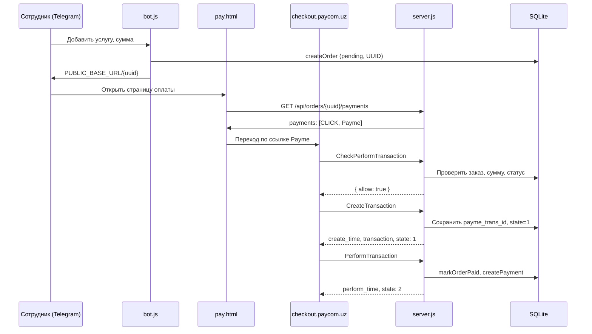

# Payme Merchant API — интеграция со ScrapRegosUserBot

Инструкция по подключению [Payme Merchant API](https://developer.help.paycom.uz/metody-merchant-api/) к проекту ScrapRegosUserBot. Документ описывает протокол, сопоставление с текущей архитектурой оплаты и пошаговый план внедрения **без изменения кода** — только как руководство для разработчика.

## Содержание

1. [Кратко о проекте и оплате](#1-кратко-о-проекте-и-оплате)
2. [Что такое Payme Merchant API](#2-что-такое-payme-merchant-api)
3. [Отличия от CLICK в этом проекте](#3-отличия-от-click-в-этом-проекте)
4. [Предварительные требования](#4-предварительные-требования)
5. [Протокол Merchant API](#5-протокол-merchant-api)
6. [Сценарий оплаты](#6-сценарий-оплаты)
7. [Сопоставление с данными ScrapRegosUserBot](#7-сопоставление-с-данными-scrapregosuserbot)
8. [План интеграции по файлам](#8-план-интеграции-по-файлам)
9. [Инициализация платежа (ссылка на checkout)](#9-инициализация-платежа-ссылка-на-checkout)
10. [Webhook: реализация JSON-RPC endpoint](#10-webhook-реализация-json-rpc-endpoint)
11. [Методы Merchant API](#11-методы-merchant-api)
12. [Хранение транзакций Payme](#12-хранение-транзакций-payme)
13. [Переменные окружения](#13-переменные-окружения)
14. [Деплой и nginx](#14-деплой-и-nginx)
15. [Песочница и тестирование](#15-песочница-и-тестирование)
16. [Чеклист перед продакшеном](#16-чеклист-перед-продакшеном)

---

## 1. Кратко о проекте и оплате

ScrapRegosUserBot — Telegram-бот для сотрудников поддержки Regos/EasyTrade. Сотрудник находит клиента, оформляет услугу с суммой в UZS; создаётся заказ в SQLite (`data/regos.db`) со статусом `pending` и UUID.

Оплата сейчас реализована через **CLICK**:

| Компонент | Файл | Роль |
|-----------|------|------|
| Telegram-бот | `bot.js`, `lib/service-bot.js` | Создание заказа, ссылка на оплату |
| Платёжный сервер | `server.js` | Статика, API, webhook CLICK |
| Провайдер CLICK | `lib/click.js` | URL оплаты, проверка подписи |
| Список способов оплаты | `lib/payments-api.js` | `GET /api/orders/:id/payments` |
| Страница оплаты | `public/pay.html`, `public/js/payment.js` | Кнопки провайдеров |
| БД | `lib/partners-db.js` | Таблицы `orders`, `payments` |

Поток для клиента:

```
Сотрудник → бот создаёт заказ (UUID, pending)
         → ссылка PUBLIC_BASE_URL/{orderId}
         → страница оплаты показывает кнопки провайдеров
         → клиент платит → webhook → заказ paid
```

В `lib/payments-api.js` уже есть комментарий для добавления Payme рядом с CLICK — фронтенд менять не нужно: достаточно вернуть ещё один объект `{ provider, label, url, enabled }` в массиве `payments`.

---

## 2. Что такое Payme Merchant API

[Merchant API](https://developer.help.paycom.uz/metody-merchant-api/) — протокол, при котором **Payme Business вызывает ваш сервер** (биллинг), а не наоборот. Подходит для стандартной платёжной формы Payme (редирект на `checkout.paycom.uz`).

Методы:

| Метод | Назначение |
|-------|------------|
| [CheckPerformTransaction](https://developer.help.paycom.uz/metody-merchant-api/checkperformtransaction) | Проверка: можно ли создать транзакцию |
| [CreateTransaction](https://developer.help.paycom.uz/metody-merchant-api/createtransaction) | Создание транзакции (бронь заказа) |
| [PerformTransaction](https://developer.help.paycom.uz/metody-merchant-api/performtransaction) | Проведение оплаты (заказ → «оплачен») |
| [CancelTransaction](https://developer.help.paycom.uz/metody-merchant-api/canceltransaction) | Отмена / возврат |
| [CheckTransaction](https://developer.help.paycom.uz/metody-merchant-api/checkperformtransaction) | Статус транзакции |
| [GetStatement](https://developer.help.paycom.uz/metody-merchant-api/getstatement) | Выписка по транзакциям |

Для ScrapRegosUserBot критичны первые пять методов; `GetStatement` опционален.

Нужна **касса для приёма платежей с биллингом** (или без биллинга — см. [настройку взаимодействия](https://developer.help.paycom.uz/nastroyka-vzaimodeystviya/)).

---

## 3. Отличия от CLICK в этом проекте

| | CLICK | Payme Merchant API |
|---|--------|---------------------|
| Направление запросов | CLICK → ваш сервер | Payme → ваш сервер |
| Формат | Два endpoint: `/click/prepare`, `/click/complete` | Один endpoint, JSON-RPC 2.0 |
| Авторизация | MD5 `sign_string` в теле | HTTP Basic: `Paycom:{KEY}` |
| Сумма | UZS (целое) | **Тийины** (1 UZS = 100 тийин) |
| Идентификатор заказа | `merchant_trans_id` = UUID заказа | `account.order_id` = UUID заказа |
| Состояния | prepare / complete | Create (state 1) → Perform (state 2) |
| Ссылка оплаты | Query-параметры на `my.click.uz` | Base64 URL или POST на `checkout.paycom.uz` |
| Повторы запросов | Минимальная обработка | **Обязательна идемпотентность** |

Текущий `server.js` — хороший образец валидации заказа и суммы; для Payme понадобится отдельный модуль и таблица/поля для промежуточных транзакций Payme.

---

## 4. Предварительные требования

### 4.1. Кабинет Payme Business

1. Зарегистрировать юрлицо и создать **веб-кассу** ([поиск ключа и ID кассы](https://developer.help.paycom.uz/poisk-klyucha-i-id-kassy-v-lichnom-kabinete/)).
2. Получить:
   - **Merchant ID** (ID кассы, 24-символьная hex-строка);
   - **KEY** — пароль для продакшена (36 символов);
   - **TEST_KEY** — пароль для [песочницы](https://developer.help.paycom.uz/pesochnitsa).
3. В настройках кассы указать **Endpoint URL** — публичный HTTPS-адрес биллинга, например:
   ```
   https://your-domain/payme
   ```
4. Настроить параметры объекта **Account** в кассе. Для ScrapRegosUserBot логично использовать поле **`order_id`** (совпадает с `orders.id` — UUID v4).

### 4.2. Тип счёта

Для заказов услуг в боте подходит **одноразовый счёт** (деньги принимаются один раз). В песочнице это явно проверяется.

### 4.3. Инфраструктура

- TLS 1.0+ на публичном домене ([требования протокола](https://developer.help.paycom.uz/protokol-merchant-api/)).
- Все ответы webhook — **HTTP 200**; иначе Payme трактует это как системную ошибку `-32400`.
- Запросы Payme приходят только с IP [185.234.113.1–185.234.113.15](https://developer.help.paycom.uz/protokol-merchant-api/skhema-vzaimodeystviya/) (опционально — whitelist на nginx/firewall).

---

## 5. Протокол Merchant API

### 5.1. Транспорт

- Метод: `POST`
- `Content-Type: text/json` или `application/json`
- Тело: JSON-RPC 2.0

Пример запроса от Payme ([формат запроса](https://developer.help.paycom.uz/protokol-merchant-api/format-zaprosa)):

```http
POST /payme HTTP/1.1
Content-Type: text/json; charset=UTF-8
Authorization: Basic <base64(Paycom:YOUR_KEY)>

{
  "method": "PerformTransaction",
  "params": { "id": "5305e3bab097f420a62ced0b" },
  "id": 2032
}
```

### 5.2. Авторизация

[Базовая HTTP-аутентификация](https://developer.help.paycom.uz/protokol-merchant-api/skhema-vzaimodeystviya/):

- **Login:** `Paycom` (уточняется у техподдержки Payme; в типовых интеграциях именно так)
- **Password:** KEY из кабинета (36 символов)

Проверка на сервере:

```javascript
// Псевдокод — не код проекта
const expected = Buffer.from(`Paycom:${process.env.PAYME_SECRET_KEY}`).toString('base64');
const auth = req.headers.authorization; // "Basic ..."
if (auth !== `Basic ${expected}`) {
  return jsonRpcError(id, -32504, 'Недостаточно привилегий');
}
```

Неверная авторизация → ошибка **-32504**.

### 5.3. Формат ответа

Успех:

```json
{
  "jsonrpc": "2.0",
  "id": 2032,
  "result": { ... }
}
```

Ошибка ([формат ответа](https://developer.help.paycom.uz/protokol-merchant-api/format-otveta), [коды ошибок](https://developer.help.paycom.uz/metody-merchant-api/oshibki-errors)):

```json
{
  "jsonrpc": "2.0",
  "id": 2032,
  "error": {
    "code": -31050,
    "message": {
      "ru": "Заказ не найден",
      "uz": "Buyurtma topilmadi",
      "en": "Order not found"
    },
    "data": "order_id"
  }
}
```

Для ошибок `-31050`…`-31099` поле `message` с локализацией **обязательно**; `data` — имя поля в `account` (например `order_id`).

### 5.4. Состояния транзакции (State)

| state | Значение |
|-------|----------|
| `1` | Создана (`CreateTransaction`), ожидает проведения |
| `2` | Проведена (`PerformTransaction`) |
| `-1` | Отменена до проведения |
| `-2` | Отменена после проведения (возврат) |

### 5.5. Суммы

- В Payme сумма всегда в **тийинах**.
- В ScrapRegosUserBot `orders.amount` хранится в **UZS** (целое, `Math.trunc`).
- Конвертация: `amountTiyin = order.amount * 100`.

---

## 6. Сценарий оплаты



При сбое дебета Payme вызывает `CancelTransaction`. Если ответ на `CreateTransaction` / `PerformTransaction` потерян — **повтор с теми же параметрами**; ответ должен совпадать с первым.

Таймаут: непроведённая транзакция отменяется через **12 часов** (43 200 000 ms) с причиной «отмена по таймауту» (reason `4`) — см. [CreateTransaction](https://developer.help.paycom.uz/metody-merchant-api/createtransaction).

---

## 7. Сопоставление с данными ScrapRegosUserBot

### Таблица `orders`

| Поле проекта | Использование в Payme |
|--------------|----------------------|
| `id` (UUID) | `account.order_id` в чеке и webhook |
| `amount` (UZS) | Сравнивать с `params.amount / 100` или `params.amount` в тийинах |
| `status` | `pending` → можно платить; `paid` → отклонить новую оплату |
| `currency` | По умолчанию `UZS` |
| `payment_transaction_id` | Сохранять Payme transaction `id` после Perform |
| `payment_provider` | Установить `'payme'` при успешной оплате |

### Таблица `payments`

Сейчас есть только `click_trans_id`. Для Payme потребуется обобщение, например:

- переименовать/добавить `external_transaction_id`, или
- добавить `payme_trans_id`, или
- хранить JSON в `metadata`.

### Функции БД (`lib/partners-db.js`)

| Сейчас | Нужно для Payme |
|--------|-----------------|
| `markOrderPaid(db, id, { clickTransId })` | Принимать `transactionId` и `provider: 'payme'` |
| `createPayment(..., clickTransId)` | Записывать ID транзакции Payme |
| — | Новая таблица `payme_transactions` (рекомендуется) |

Рекомендуемая таблица `payme_transactions`:

```sql
CREATE TABLE payme_transactions (
  payme_id TEXT PRIMARY KEY,        -- id из Payme
  order_id TEXT NOT NULL,
  amount INTEGER NOT NULL,          -- тийины
  state INTEGER NOT NULL,           -- 1, 2, -1, -2
  create_time INTEGER NOT NULL,
  perform_time INTEGER,
  cancel_time INTEGER,
  cancel_reason INTEGER,
  created_at TEXT NOT NULL DEFAULT (datetime('now'))
);
```

Это соответствует требованию Payme хранить транзакции в постоянном хранилище и обрабатывать повторные вызовы.

---

## 8. План интеграции по файлам

Изменения **не внесены** в репозиторий — ниже план для реализации.

### 8.1. Новый файл `lib/payme.js`

По аналогии с `lib/click.js`:

| Функция | Назначение |
|---------|------------|
| `requiredEnv(name)` | Чтение `PAYME_*` из `.env` |
| `uzsToTiyin(amount)` | `Math.trunc(amount) * 100` |
| `formatPaymeUrl(orderId, amountUzs)` | Ссылка на checkout (см. §9) |
| `verifyPaymeAuth(req)` | Basic Auth |
| `buildJsonRpcResult(id, result)` | Обёртка ответа |
| `buildJsonRpcError(id, code, message, data)` | Обёртка ошибки |

### 8.2. Расширить `lib/payments-api.js`

```javascript
// Место для добавления — после buildClickPaymentOption (строка ~47)
function buildPaymePaymentOption(order) {
  try {
    return {
      provider: 'payme',
      label: 'Payme',
      url: formatPaymeUrl(order.id, order.amount),
      enabled: true,
    };
  } catch {
    return null;
  }
}
```

В `getPaymentOptionsForOrder` добавить вызов `buildPaymePaymentOption` рядом с CLICK.

### 8.3. Расширить `server.js`

Добавить маршрут:

```
POST /payme  →  handlePaymeJsonRpc(req, res)
```

Один handler разбирает `body.method` и делегирует в функции из `lib/payme-handlers.js` (или внутри `lib/payme.js`).

**Важно:** маршрут `/payme` должен быть объявлен **до** `app.get('/:orderId', ...)`, иначе Express может перехватить `payme` как UUID.

### 8.4. Опционально: `lib/payme-handlers.js`

Логика методов + работа с БД — чтобы `server.js` не разрастался (правило: файлы < 500 строк).

### 8.5. `lib/partners-db.js`

- Миграция/создание `payme_transactions`.
- `getPaymeTransaction(db, paymeId)`, `upsertPaymeTransaction(...)`.
- Обобщение `markOrderPaid` / `createPayment`.

### 8.6. `.env.example`

Добавить переменные (см. §13). **Не коммитить** реальные KEY в git.

### 8.7. `docs/click-deploy-linux.md`

Добавить `location /payme` в nginx (см. §14).

### 8.8. Фронтенд

`public/js/payment.js` — **без изменений** (уже рендерит любые кнопки из API).

---

## 9. Инициализация платежа (ссылка на checkout)

После настройки Merchant API нужно [инициализировать платёж](https://developer.help.paycom.uz/initsializatsiya-platezhey/) — отправить «чек» в Payme.

### Способ 1: GET URL (удобно для `formatPaymeUrl`)

[Отправка чека по GET](https://developer.help.paycom.uz/initsializatsiya-platezhey/otpravka-cheka-po-metodu-get/):

1. Собрать строку параметров (разделитель `;`):
   ```
   m={MERCHANT_ID};ac.order_id={ORDER_UUID};a={AMOUNT_TIYIN}
   ```
2. Закодировать в Base64 (без переносов строк).
3. URL:
   - Продакшен: `https://checkout.paycom.uz/{BASE64}`
   - Песочница: `https://test.paycom.uz/{BASE64}`

Пример для заказа `197` на 5 UZS (500 тийин):

```
Данные:  m=587f72c72cac0d162c722ae2;ac.order_id=197;a=500
URL:     https://checkout.paycom.uz/bT01ODdmNzJjNzJjYWMwZDE2MmM3MjJhZTI7YWMub3JkZXJfaWQ9MTk3O2E9NTAw
```

Дополнительные параметры:

| Параметр | Описание |
|----------|----------|
| `l` | Язык: `ru`, `uz`, `en` |
| `c` | URL возврата после оплаты/отмены |
| `ct` | Задержка перед редиректом (мс) |

Для ScrapRegosUserBot:

```javascript
// Псевдокод formatPaymeUrl
const params = [
  `m=${merchantId}`,
  `ac.order_id=${orderId}`,
  `a=${uzsToTiyin(amountUzs)}`,
  `l=ru`,
  process.env.PAYME_RETURN_URL ? `c=${encodeURIComponent(process.env.PAYME_RETURN_URL)}` : null,
].filter(Boolean).join(';');

const base = process.env.PAYME_TEST_MODE === '1'
  ? 'https://test.paycom.uz'
  : 'https://checkout.paycom.uz';

return `${base}/${Buffer.from(params, 'utf8').toString('base64')}`;
```

### Способ 2: POST-форма

Альтернатива — HTML-форма с `action="https://checkout.paycom.uz"` и полями `merchant`, `amount`, `account[order_id]`, `callback`. Для текущей архитектуры (кнопка-ссылка на странице) проще GET URL.

---

## 10. Webhook: реализация JSON-RPC endpoint

### 10.1. Каркас обработчика

```javascript
// Псевдокод для server.js
app.post('/payme', (req, res) => {
  const body = req.body ?? {};
  const requestId = body.id;

  if (!verifyPaymeAuth(req)) {
    return res.status(200).json(buildJsonRpcError(requestId, -32504, ...));
  }

  const handlers = {
    CheckPerformTransaction,
    CreateTransaction,
    PerformTransaction,
    CancelTransaction,
    CheckTransaction,
    // GetStatement — по необходимости
  };

  const handler = handlers[body.method];
  if (!handler) {
    return res.status(200).json(buildJsonRpcError(requestId, -32601, ...));
  }

  try {
    const result = handler(db, body.params, requestId);
    return res.status(200).json(buildJsonRpcResult(requestId, result));
  } catch (err) {
    return res.status(200).json(buildJsonRpcError(requestId, -32400, ...));
  }
});
```

Всегда отвечать **status 200**, ошибки — в теле JSON-RPC.

### 10.2. Общая валидация заказа

Переиспользовать логику из `server.js`:

```javascript
function amountsEqualTiyin(paymeAmount, orderAmountUzs) {
  return Number(paymeAmount) === Number(orderAmountUzs) * 100;
}
```

Для `CheckPerformTransaction` / `CreateTransaction`:

1. Извлечь `orderId = params.account.order_id`.
2. `getOrderById(db, orderId)`.
3. Если заказ не найден → `-31050`…`-31099`, `data: "order_id"`.
4. Если `status !== 'pending'` (уже оплачен) → `-31008` или `-31099` в зависимости от сценария.
5. Если сумма не совпадает → `-31001`.

---

## 11. Методы Merchant API

### 11.1. CheckPerformTransaction

**Когда:** перед созданием транзакции.

**Запрос:**

```json
{
  "method": "CheckPerformTransaction",
  "params": {
    "amount": 500000,
    "account": { "order_id": "550e8400-e29b-41d4-a716-446655440000" }
  },
  "id": 1
}
```

**Логика для ScrapRegosUserBot:**

- Заказ существует, `status === 'pending'`.
- `params.amount === order.amount * 100`.
- Нет активной другой Payme-транзакции на этот заказ в state `1` (иначе `-31008` при Create).

**Успешный ответ:**

```json
{
  "jsonrpc": "2.0",
  "id": 1,
  "result": { "allow": true }
}
```

Дополнительно можно вернуть `detail` с описанием услуги (если нужно отображение в Payme).

### 11.2. CreateTransaction

**Когда:** Payme создаёт транзакцию, бронирует сумму.

**Запрос:** `id`, `time`, `amount`, `account` — см. [документацию](https://developer.help.paycom.uz/metody-merchant-api/createtransaction).

**Логика:**

1. Повторить проверки суммы и заказа.
2. Если запись с `payme_id = params.id` уже есть — вернуть **тот же** результат (идемпотентность).
3. Если у заказа уже есть **другая** незавершённая транзакция → `-31008`.
4. Вставить в `payme_transactions` (`state = 1`, `create_time = Date.now()`).
5. Заказ остаётся `pending` (как «ожидание оплаты»).

**Ответ:**

```json
{
  "result": {
    "create_time": 1399114284039,
    "transaction": "550e8400-e29b-41d4-a716-446655440000",
    "state": 1
  }
}
```

`transaction` — строка на усмотрение мерчанта; удобно использовать UUID заказа или внутренний ID.

### 11.3. PerformTransaction

**Когда:** деньги списаны, нужно зачислить мерчанту.

**Запрос:** `{ "id": "<payme_transaction_id>" }`.

**Логика:**

1. Найти `payme_transactions` по `payme_id`.
2. Если не найдено → `-31003`.
3. Если уже `state === 2` → вернуть тот же успешный ответ (идемпотентность).
4. Если заказ уже `paid` с этой же транзакцией → повторить успешный ответ.
5. Иначе:
   - `createPayment(db, { provider: 'payme', ... })`
   - `markOrderPaid(db, orderId, { transactionId: paymeId, provider: 'payme' })`
   - обновить `payme_transactions` → `state = 2`, `perform_time`.

Аналог текущего `/click/complete` в `server.js` (строки 69–100).

### 11.4. CancelTransaction

**Когда:** отмена до/после проведения, таймаут, ошибка дебета.

**Запрос:** `id`, `reason`.

**Логика:**

- Найти транзакцию; если нет → `-31003`.
- Если заказ уже оказан полностью и отмена невозможна → `-31007`.
- Обновить `state` (`-1` или `-2`), `cancel_time`, `cancel_reason`.
- Заказ остаётся `pending` (если не был paid) или обрабатывается возврат по бизнес-правилам.

### 11.5. CheckTransaction

**Запрос:** `{ "id": "<payme_transaction_id>" }`.

**Ответ:** `create_time`, `perform_time`, `cancel_time`, `transaction`, `state`, `reason` — см. [CheckTransaction](https://developer.help.paycom.uz/metody-merchant-api/checkperformtransaction).

Используется Payme для сверки; обязателен в [песочнице](https://developer.help.paycom.uz/pesochnitsa).

### 11.6. GetStatement

Возвращает список транзакций за период. Для бота с ручными заказами обычно достаточно `payments` + `payme_transactions`; метод можно реализовать позже.

---

## 12. Хранение транзакций Payme

Минимальные требования Payme к `CreateTransaction`:

- Постоянное хранилище (SQLite подходит).
- Бронь заказа до оплаты или отмены.
- Запрет «двойной оплаты» одноразового счёта.
- Идемпотентность при повторных `Create` / `Perform` / `Cancel`.

Связь сущностей:

```
orders (1) ←—— (N) payme_transactions
orders (1) ←—— (N) payments (provider = 'payme')
```

При успешном `PerformTransaction`:

```javascript
// Псевдокод — аналог server.js /click/complete
createPayment(db, {
  orderId: order.id,
  telegramId: order.telegram_id,
  amount: order.amount,
  provider: 'payme',
  externalTransactionId: paymeId,
});
markOrderPaid(db, order.id, {
  transactionId: paymeId,
  provider: 'payme',
});
```

---

## 13. Переменные окружения

Добавить в `.env` (и в `.env.example` при реализации):

```env
# Payme Merchant API
PAYME_MERCHANT_ID=your_24_char_merchant_id
PAYME_SECRET_KEY=your_36_char_key_from_cabinet
PAYME_TEST_KEY=your_sandbox_test_key
PAYME_TEST_MODE=0
PAYME_RETURN_URL=https://your-domain/thanks
```

| Переменная | Описание |
|------------|----------|
| `PAYME_MERCHANT_ID` | ID веб-кассы |
| `PAYME_SECRET_KEY` | KEY (продакшен), пароль Basic Auth |
| `PAYME_TEST_KEY` | TEST_KEY для песочницы |
| `PAYME_TEST_MODE` | `1` — checkout `test.paycom.uz` и TEST_KEY в webhook; `0` — продакшен |
| `PAYME_RETURN_URL` | Редирект после оплаты (опционально, параметр `c`) |

Существующие переменные CLICK и `PUBLIC_BASE_URL` остаются без изменений.

---

## 14. Деплой и nginx

Платёжный сервер тот же: `npm run server` (порт `CLICK_SERVER_PORT`, по умолчанию 3000).

В конфиг nginx (по аналогии с [click-deploy-linux.md](./click-deploy-linux.md)) добавить:

```nginx
location /payme {
  proxy_pass http://127.0.0.1:3000/payme;
  proxy_set_header Host $host;
  proxy_set_header X-Forwarded-For $proxy_add_x_forwarded_for;
  proxy_set_header X-Forwarded-Proto $scheme;
}
```

В кабинете Payme Business:

- **Endpoint URL:** `https://your-domain/payme`

Остальные location (`/api/`, UUID-пути для страницы оплаты, `/click/`) не меняются.

---

## 15. Песочница и тестирование

Документация: [Песочница Payme](https://developer.help.paycom.uz/pesochnitsa).

### Подготовка

1. Создать веб-кассу → получить Merchant ID и TEST_KEY.
2. Endpoint URL указать на тестовый/стейджинг домен с HTTPS.
3. В песочнице ввести Merchant ID и TEST_KEY.
4. `PAYME_TEST_MODE=1`, webhook проверяет TEST_KEY вместо KEY.

### Сценарии (обязательные)

**Сценарий 1 — создание и отмена неподтверждённой транзакции**

- Неверная авторизация → `-32504`
- Неверная сумма → `-31001`
- Несуществующий `order_id` → `-31050`…`-31099`
- Успешные `CheckPerformTransaction`, `CreateTransaction`, `CheckTransaction`
- Повторный `CreateTransaction` с тем же `id` → тот же ответ
- Вторая транзакция на тот же заказ → `-31008`
- `CancelTransaction` для state `1`

**Сценарий 2 — создание, подтверждение и отмена проведённой**

- Полный цикл до `PerformTransaction` (state `2`)
- Повторный `PerformTransaction` → тот же ответ
- `CancelTransaction` после проведения (state `-2`)

### Локальная проверка

1. Создать заказ через бота.
2. Открыть `https://your-domain/{order_uuid}` — должна появиться кнопка Payme.
3. Пройти оплату в песочнице.
4. Проверить в SQLite: `orders.status = 'paid'`, запись в `payments` с `provider = 'payme'`.

### Тестовые URL чека

- Песочница: `https://test.paycom.uz/...`
- Продакшен: `https://checkout.paycom.uz/...`

Инициализацию платежа в продакшене рекомендуется тестировать **после** успешного прохождения песочницы.

---

## 16. Чеклист перед продакшеном

- [ ] Веб-касса с биллингом, Account-параметр `order_id` совпадает с кодом
- [ ] Endpoint `https://your-domain/payme` доступен по HTTPS, TLS 1.0+
- [ ] Basic Auth: login `Paycom`, password = KEY из кабинета
- [ ] Все JSON-RPC ответы с HTTP 200
- [ ] Суммы сравниваются в тийинах (`order.amount * 100`)
- [ ] Идемпотентность Create / Perform / Cancel
- [ ] Таблица `payme_transactions` и таймаут 12 часов учтены
- [ ] Песочница: оба сценария пройдены
- [ ] nginx: `location /payme` добавлен
- [ ] `PAYME_TEST_MODE=0`, используется `PAYME_SECRET_KEY`
- [ ] Секреты только в `.env`, не в git
- [ ] (Опционально) whitelist IP Payme 185.234.113.1–15
- [ ] (Опционально) уведомление в Telegram после оплаты — сейчас не реализовано даже для CLICK

---

## Ссылки

- [Методы Merchant API](https://developer.help.paycom.uz/metody-merchant-api/)
- [Протокол Merchant API](https://developer.help.paycom.uz/protokol-merchant-api/)
- [Схема взаимодействия и авторизация](https://developer.help.paycom.uz/protokol-merchant-api/skhema-vzaimodeystviya/)
- [Настройка взаимодействия](https://developer.help.paycom.uz/nastroyka-vzaimodeystviya/)
- [Инициализация платежей (GET)](https://developer.help.paycom.uz/initsializatsiya-platezhey/otpravka-cheka-po-metodu-get/)
- [Ошибки (ERRORS)](https://developer.help.paycom.uz/metody-merchant-api/oshibki-errors)
- [Песочница](https://developer.help.paycom.uz/pesochnitsa)
- [Деплой CLICK в проекте](./click-deploy-linux.md)
